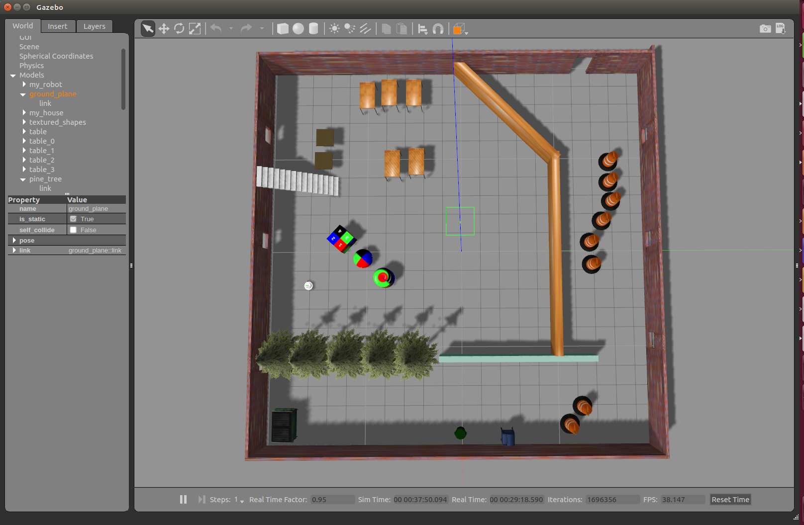
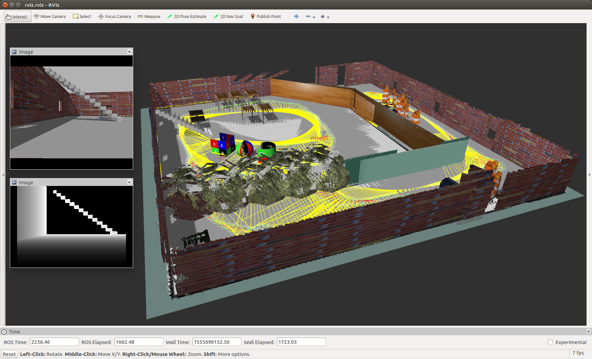
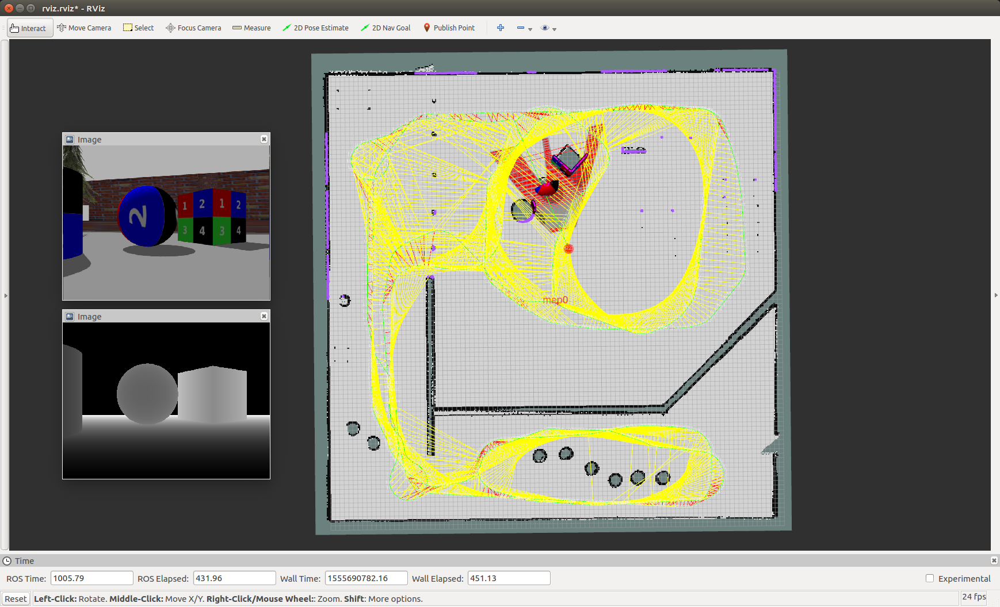
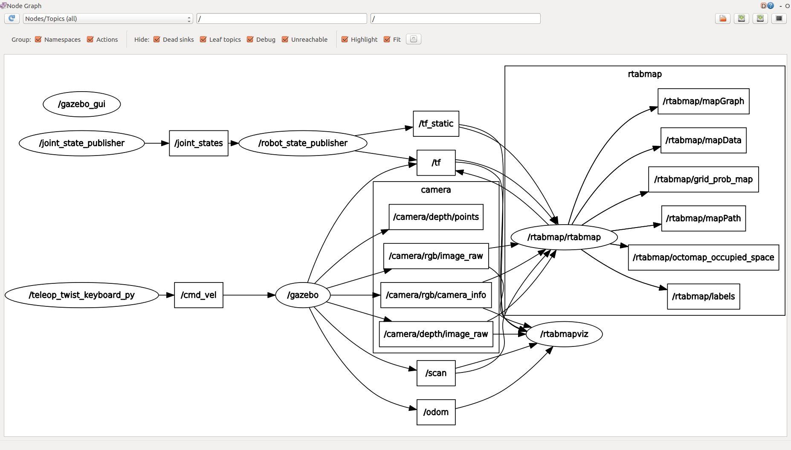
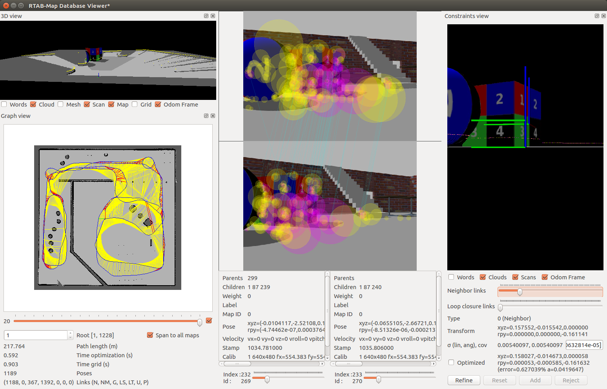

# Map My World

## Contents

There are 3 packages:<br>
* **teleop_twist_keyboard** is for manual control of robot motion.
* **my_robot** contains gazebo environemnts for the robot.
* **my_navigation** contains launch files for executing the *rtabmap* based mapping, and localization functions. 
* Note that some example snapshots of the robot simulator can be found inside the folder **results/**.

#### Remarks
For localization demo (as described in section 2.2), the pre-built *rtabmap* database can be alternatively downloaded from <a href="https://drive.google.com/open?id=1QHlRCMySEv10ljZ6SmvodWShnIs_H-G1" download>HERE</a>. Before using it, you have to paste the *rtabmap.db* file inside the *data* folder of *my_navigation* package.

## Usage

#### 1. Run the Robot Environment<br>

- In the first terminal
```
$ roslaunch my_robot world.launch
```
- In the second terminal
```
$ roslaunch my_navigation teleop.launch
```

#### 2. Demo

##### 2.1. Mapping Demo

- Note that the _database_path_ for *rtabmap* mapping is set to ```$(find my_navigation)/data/rtabmap.db``` by default.
- In a new terminal
```
$ roslaunch my_navigation mapping.launch
```

##### 2.2. Localization Demo

- Make sure that you have the *rtabmap.db* inside your *my_navigation* package before running.
- In a new terminal
```
$ roslaunch my_navigation localization.launch
```

## Example Snapshots

##### Gazebo environment
<br>

##### RTABMAP Mapping
<br>

##### RTABMAP Localization
<br>

##### rqt_graph
```
$ rosrun rqt_graph rqt_graph
```
<br>

##### Database Viewer
```
$ rtabmap-databaseViewer <your_workspace>/src/my_navigation/data/rtabmap.db
```
<br>
